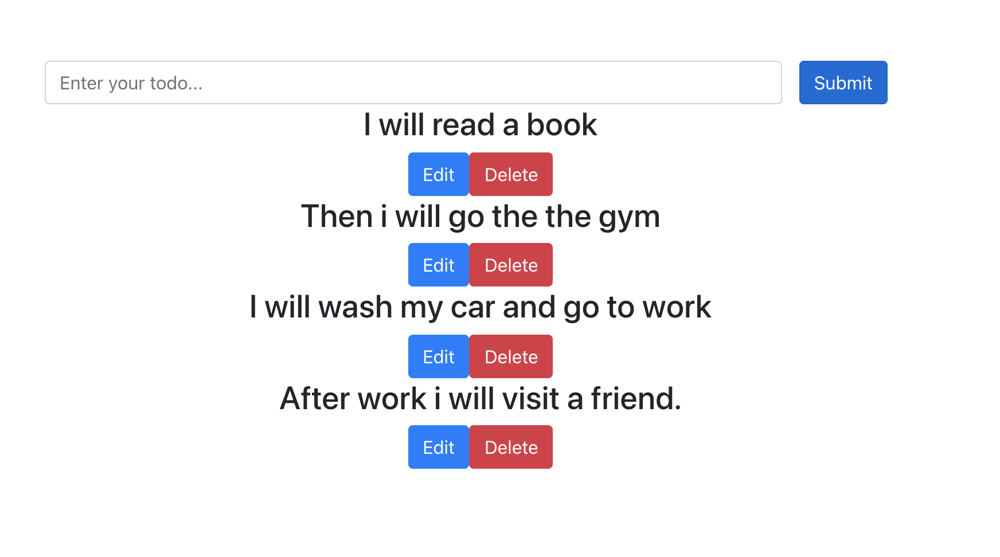

# Simple todo app using REACT NODE PG CORS POSTGRES as database.

## From server folder run "node index.js"

The server side work with a database.
I created a database name "my_todos" and a single table named "todos"

## From client folder run "npm start"

The client side was generated with "create react app"
I renamed .git folder to avoid submodule issues.
I did git init from todo-app to keep track of the project.

## The app allows us to:

1. Add multiple todos
2. Edit previews todos
3. Delete todos

### Edit button is bootstrap modal

1. One button to save changes
2. close and x buttons close the edit process.
